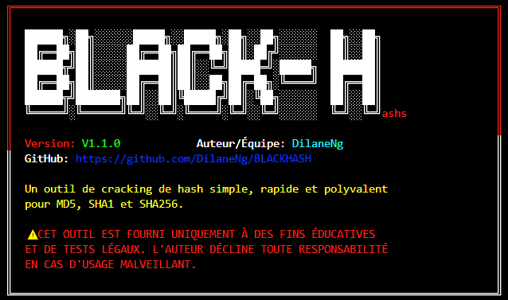
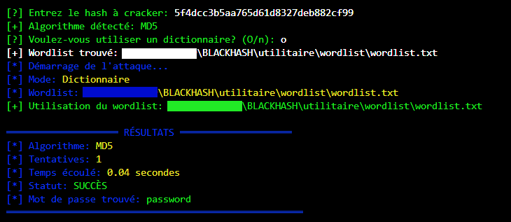

# DEEPMAP
Outil de scan complet de réseau local (LAN).


[](https://github.com/DilaneNg/BLACKHASH)
[](https://www.python.org/)
[]()
[](LICENSE)

---

## 📋 Description  
**DEEPMAP** est un outils **Python** capable de scanner un réseau **local (LAN)**, détecter les **hôtes actifs**, lister les **ports ouverts** et **générer un rapport détaillé** en PDF ou HTML.

---

## ✨ Fonctionnalités
- 🔍 Scanner une plage d’adresses IP spécifiée  
- 📚 Détecter les hôtes actifs avec **ping** ou **ARP** 
- 💪 Scanner les ports ouverts les plus courants (TCP 22, 80, 443, 3389...) 
- 🎨 Identifier le système d’exploitation ou type d’appareil (**via TTL**). 
- 🐧 Multiplateforme (**Windows et Linux**)
- ⚡ Générer un rapport automatique avec : 
  - 🔧 Liste des hôtes
  - 🔧Ports ouverts
  - 🔧Statistiques (nombre d’hôtes actifs, ports les plus utilisés)
  - 🔧Graphiques simples (optionnel)  

---

## 📦 Installation  

### 🔑 Prérequis
- Python **3.x**  
- pip (gestionnaire de paquets Python)  

### ⚙️ Installation des dépendances
```bash
pip install colorama
```

### 📥 Téléchargement
```bash
git clone https://github.com/moi-237/DEEPMAP.git
cd DEEPMAP
```

---

## 🚀 Utilisation  

### Mode simple
```bash
python DEEPMAP.py
```
👉 L'outil vous guidera interactivement pour le choix des options.

### Mode avancé avec arguments
```bash
python BlackHash.py [HASH] [OPTIONS]
```

#### 📑 Options disponibles
| Option | Description |
|--------|-------------|
| `-h, --help` | Affiche l'aide |
| `-a ALGO, --algorithm ALGO` | Spécifie l'algorithme (**MD5/SHA1/SHA256**) |
| `-w FICHIER, --wordlist FICHIER` | Chemin vers le fichier wordlist |
| `-b, --bruteforce` | Utilise l'attaque par force brute |
| `-m LONGUEUR, --max-length LONGUEUR` | Longueur maximale pour le bruteforce *(défaut: 8)* |

#### Exemples

- **Attaque par dictionnaire :**
```bash
python BlackHash.py 5f4dcc3b5aa765d61d8327deb882cf99 -a MD5 -w wordlist.txt
```

- **Attaque par force brute :**
```bash
python BlackHash.py 5f4dcc3b5aa765d61d8327deb882cf99 -b -m 6
```

---

## 📁 Structure des wordlists  

L'outil recherche automatiquement les wordlists dans plusieurs emplacements :
- Répertoire courant  
- `./utilitaire/wordlist/`  
- `/usr/share/wordlists/` *(Linux)*  

**Fichiers par défaut :**
- `wordlist.txt`  
- `common_passwords.txt`  
- `rockyou.txt`  

### ➕ Création d'un wordlist personnalisé
Créez un fichier texte avec un mot de passe par ligne :
```bash
# Exemple de wordlist simple
password
123456
admin
qwerty
letmein
```

---

## 🛠️ Technologies / outils
- **Python 3** →  <a href="https://www.python.org" target="_blank" rel="noreferrer">  </a>
- **Modules** → scapy, socket, nmap (Python-nmap), reportlab ou pdfkit pour PDF
- **(Optionnel)** → matplotlib ou plotly pour graphiques

---

## ⚠️ Avertissement légal
Cet outil est fourni uniquement à des fins **éducatives** et de **tests légaux**.  
L'auteur décline toute responsabilité en cas d'usage malveillant.  
👉 **N'utilisez cet outil que sur des systèmes dont vous avez l'autorisation explicite.**

---

## 📸 Screenshots
  
> **MENU**

  

> **ANALYSE**

  

---

## 📞 Support
- Auteur/Équipe : **moi-237**  
- GitHub : [https://github.com/moi-237/DEEPMAP](https://github.com/moi-237/DEEPMAP)  
- Version : **V1.0.0**  

---

## 📄 Licence
Ce projet est **open source** sous licence [MIT](LICENSE).  
